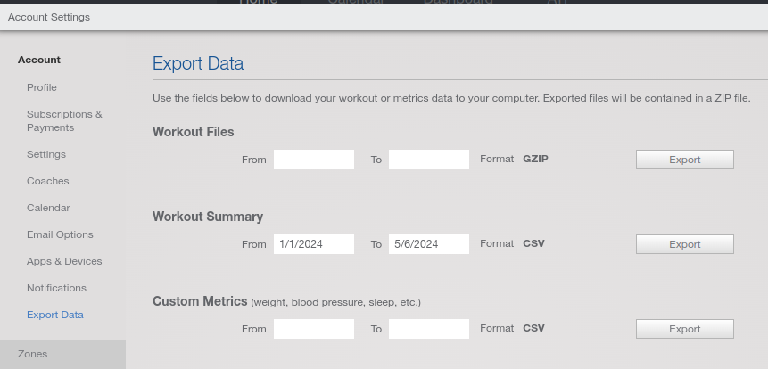

# Stef Peaks!

Dit script bestaat uit twee onderdelen. Een excel lezer (load_excel.py) en een csv lezer (load_csv.py). Excel is voor het schema en csv voor TP bestanden.

## Python installeren

Installeer eerst python (of anaconda) op je pc. Als het goed is moet je nu in een terminal de commando's `python` en `pip` kunnen draaien. Navigeer vervolgens naar de projectmap en voer dan de volgende code uit:
`$ pip install -r requirements.txt`
Hiermee installeer je alle libraries die nodig zijn.

## Dit script installeren

Dit script staat gehost op github.com. De toegevoegde waarde van git is dat het een handige plek is om code op te slaan en up-to-date te houden. Ook zit er versiebeheer in en is het makkelijk voor meerdere mensen om er mee samen te werken. De reden dat ik er voor heb gekozen om dit te gebruiken is dan ook zodat ik jullie niet de hele tijd de code hoef op te sturen als er kleine wijzigingen zijn geweest, je kan gewoon zelf de nieuwe code er af halen.

Om het script op je laptop te krijgen kan je twee dingen doen. De eerste optie is om git te installeren. Dit is wel meteen wat ambitieus maar maakt het proces later een stuk makkelijker. De tweede optie is om hier rechtsboven naar de groene knop met ' <> Code' te gaan en daar op te klikken. In het dropdown menu kan je dan de code als een .zip bestand downloaden.  

## CSV Lezer

Om TP files te analyzeren moet je inloggen op TP en daar in de settings 'Workout Summaries' exporteren. Deze horen dan thuis in de 'workouts' map. Laat deze files als een .zip bestand staan, de loader maakt er automatisch csv documenten van.



Vervolgens is het een kwestie van het uitvoeren van het script: `python load_csv.py`. Het script vraagt om welke roeier je wil analyseren en produceert een plot in de 'plots' map.

### Weegfactoren

In de 'stefpeaks' map zit een bestand genaamd 'conversion_factors.py'. Hier kan je de weegfactoren van de verschillende trainingsvormen aanpassen. De code ziet er als volgt uit:

```
cf = {
    'strength': 1,
    'rowing': 1,
    'indoor rowing': 1,
    'hiking': 0.5,
    'cycling': 0.8, 
    'indoor cycling': 0.95, 
    'alpine skiing': 0.7,
    'other': 1,
}
```
Het getal achter de training is de factor waarmee de TSS wordt vermenigvuldigt. De plot heeft bovenaan tabbladen. Het eerste tabblad laat het standaard TP riedeltje zien met CTL, ATL, form, etc. Het tweede tabblad doet hetzelfde, maar dan voor de gewogen TSS waardes (CTSS). Tabblad 3 is een tabel met alle workouts. Hier staan vaak veel duplicaten in, dat gaat dan om een geplande en een uitgevoerde workout op dezelfde dag die TP niet heeft samengevoegd. Op tabblad 4 staat een overzicht van alle dagen waarbij de geplande en uitgevoerde uren per dag staan opgesomd.